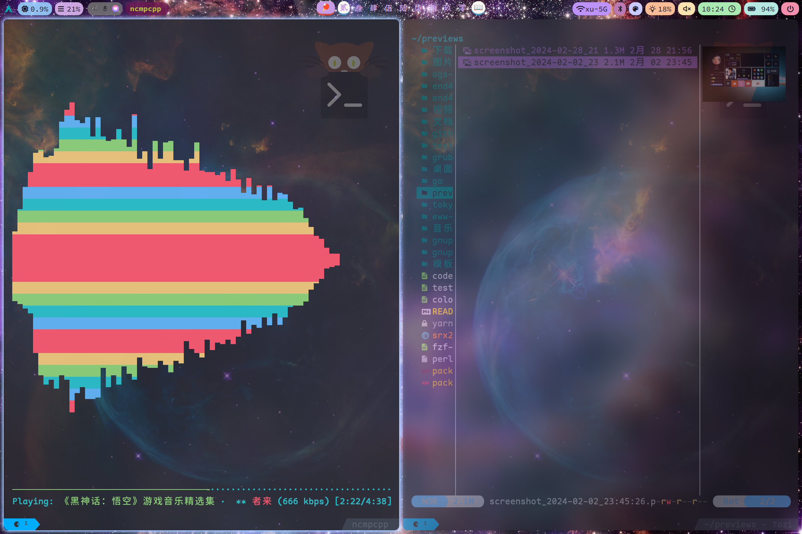
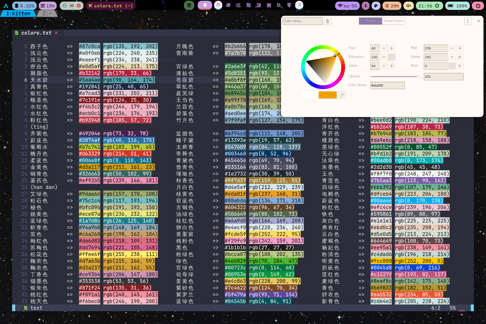
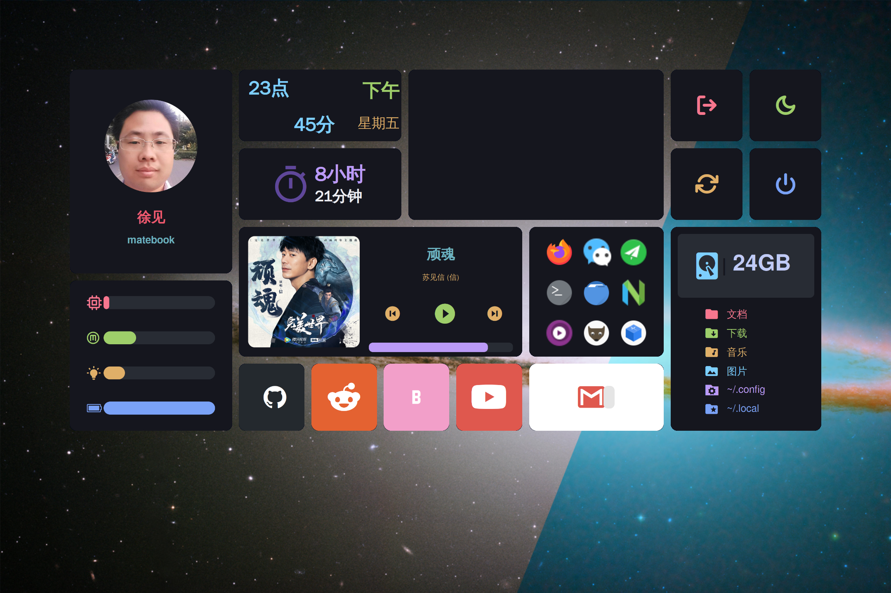

  <h2 align="center"><b> ~ xu8533's configuration files ~ </b></h2>

<!-- BADGES -->

    
    

## 🌟 PREVIEW

<!-- INFORMATION -->

## :herb: <samp>INFORMATION</samp> 

- **Window Manager:** [Hyprland](https://www.hyprland.org)
- **OS:** [Arch Linux](https://archlinux.org)
- **Editor:** [Neovim](https://github.com/neovim/neovim)
- **Terminal:** 󰄛[Kitty](https://github.com/kovidgoyal/kitty)
- **Shell:** [Bash](https://www.gnu.org/savannah-checkouts/gnu/bash/bash.html)
- **Widgets:** 󰜬[EWW](https://github.com/elkowar/eww)
- **Application Launcher:** 󱓞[Rofi](https://github.com/davatorium/rofi)
- **Browser:** [Firefox](https://www.mozilla.org/en-US/firefox)
- **File Manager:** 󰪶[Thunar](https://github.com/xfce-mirror/thunar)
- **Status Bar:** [Waybar](https://github.com/Alexays/Waybar)

<!-- SETUP -->

## :wrench: <samp>SETUP</samp>

## :rocket: <samp>MISCELLANEOUS</samp>
<h3 align="center"><b> 浪淘沙🔹北戴河  </b></h2>

大雨落幽燕，
白浪滔天，
秦皇岛外打鱼船。 
一片汪洋都不见，
知向谁边？ 
 
往事越千年，
魏武挥鞭，
东临碣石有遗篇。 
萧瑟秋风今又是，
换了人间。 

   

