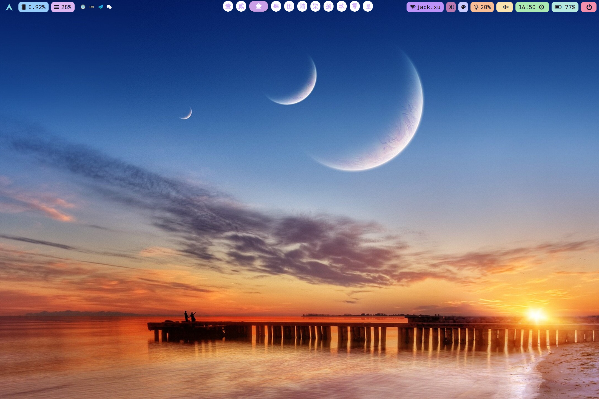
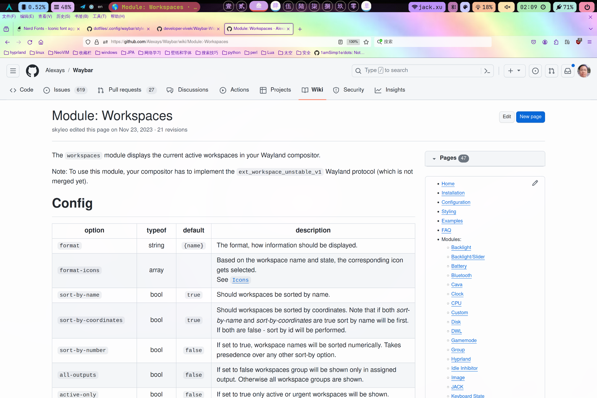
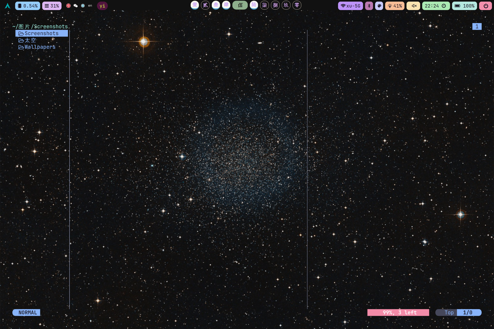

### $\textcolor{#2874af}{我的hyprland配置文件}$

### 🌟 Preview

**my dotfiles, hyprland, eww, waybar, neovim, rofi**

- **Window Manager:** [hyprland](https://www.hyprland.org)
- **OS:** [Arch Linux](https://archlinux.org)
- **Editor:** [neovim](https://github.com/neovim/neovim)
- **Terminal:** 󰄛[kitty](https://github.com/kovidgoyal/kitty)
- **Shell:** [bash](https://wiki.archlinux.org/index.php/Zsh)
- **Widgets:** 󰜬[eww](https://github.com/elkowar/eww)
- **Application Launcher:** 󱓞[rofi](https://github.com/davatorium/rofi)
- **Browser:** [firefox](https://www.mozilla.org/en-US/firefox)
- **File Manager:** 󰪶[thunar](https://github.com/xfce-mirror/thunar)
- **Status Bar:** [waybar](https://github.com/Alexays/Waybar)
